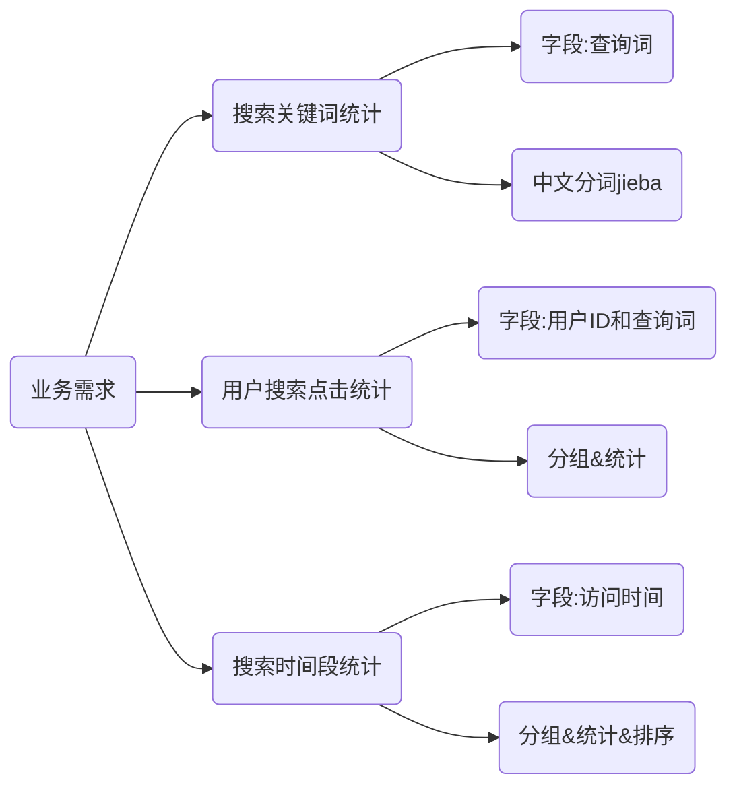
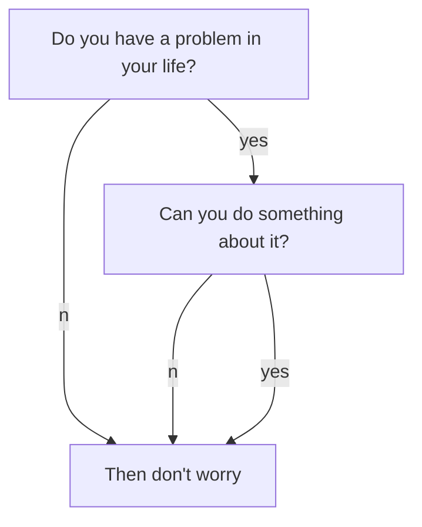

## 第3章 RDD 持久化

### RDD 的数据是过程数据

RDD 之间进行相互迭代计算（Transformation），当执行开启后，新 RDD 的生成，代表老 RDD 的消失

RDD 的数据是过程数据，只在处理的过程中存在，一旦处理完成，就不见了。

### RDD 的缓存

基于 [[2021-12-15-SparkCore#RDD 的数据是过程数据|RDD 的数据是过程数据]]，如果需要重复使用中间 RDD，那么需要重复生成这个中间 RDD。

因此，Spark 提供了缓存 API，可以让我们通过调用 API，将指定的 RDD 数据保留在**内存或硬盘**上。

API：
```python
RDD.cache()
RDD.persist(storageLevel=StorageLevel(False, True, False, False, 1))
# 可选 storageLevel
# DISK_ONLY
# DISK_ONLY_2
# DISK_ONLY_3
# MEMORY_AND_DISK
# MEMORY_AND_DISK_2
# MEMORY_AND_DISK_DESER
# MEMORY_ONLY
# MEMORY_ONLY_2
# OFF_HEAP
```

- 缓存技术可以将过程 RDD 数据，持久化保存到内存或者硬盘上
- 在设计上**存在**丢失风险，因此，Spark 会保留 RDD 之间的血缘关系

### RDD 的 CheckPoint

也是将 RDD 的数据保存起来，但是它**仅支持硬盘存储**

API：
```python
SparkContext.setCheckpointDir(dirName)  # 指定checkpoint存储目录，支持本地文件、hdfs
RDD.checkpoint()
```

- 在设计上认为是安全的，因此，不会保留血缘关系

### 缓存和 CheckPoint 的对比

| | 缓存 | CheckPoint |
| --- | :---: | :---: |
| 形式 | 分散存储 | 集中存储 |
| 风险 | 缓存分区越多，风险越高 | 不管分区数量多少，风险是一样的 |
| HDFS | 不支持 | 支持 |
| 内存 | 支持 | 不支持 |
| 设计安全 | 不安全（保留血缘关系） | 安全（不保留血缘关系） |

**注意**：

CheckPoint 是一种重量级的使用，也就是 RDD 的重新计算成本很高的时候，或者数据量很大时，我们采用 CheckPoint 比较合适。

如果数据量小，或者 RDD 重新计算是非常快的，用 CheckPoint 没有必要，直接缓存即可。


## 第4章 RDD 案例练习

### 搜索引擎日志分析案例

源数据：

[用户查询日志(SogouQ)](http://www.sogou.com/labs/resource/q.php)

需求：





#### jieba 库使用入门

jieba是优秀的中文分词第三方库

三种模式：
- 精确模式（`jieba.cut(s)`）：把文本精确的切分开，不存在冗余单词
- 全模式（`jieba.cut(s,cut_all=True)`）：把文本中所有可能的词语都扫描出来，有冗余
- 搜索引擎模式（`jieba.cut_for_search(s)`）：在精确模式基础上，对长词再次切分

#### 案例实现代码

```python
from pyspark import SparkConf, SparkContext
from defs import context_jieba, filter_words, append_words, extract_user_and_words
from operator import add

if __name__ == '__main__':
    conf = SparkConf().setAppName('myApp').setMaster('local')
    sc = SparkContext(conf=conf)

    file_rdd = sc.textFile('./data/input/SogouQ.txt')
    split_rdd = file_rdd.map(lambda x: x.split("\t"))
    split_rdd.cache()  # 写入缓存

    # 搜索关键词统计
    context_rdd = split_rdd.map(lambda x: x[2])
    words_rdd = context_rdd.flatMap(context_jieba)
    filter_rdd = words_rdd.filter(filter_words)
    append_rdd = filter_rdd.map(append_words)
    # 聚合
    result1 = append_rdd.reduceByKey(lambda a, b: a + b).\
        sortBy(lambda x: x[1], ascending=False).\
        take(5)
    print(result1)

    # 用户搜索点击统计
    user_content_rdd = split_rdd.map(lambda x: (x[1], x[2]))
    user_words_rdd = user_content_rdd.flatMap(extract_user_and_words)
    # 聚合
    result2 = user_words_rdd.reduceByKey(lambda a,b: a+b).\
        sortBy(lambda x: x[1], ascending=False).\
        take(5)
    print(result2)

    # 搜索时间段统计
    time_rdd = split_rdd.map(lambda x: x[0])
    hour_rdd = time_rdd.map(lambda x: (x.split(":")[0], 1))
    #聚合
    result3 = hour_rdd.reduceByKey(add).\
        sortBy(lambda x: x[1], ascending=False).\
        take(5)
    print(result3)
print(result3)
```

*defs.py*

```python
import jieba

def context_jieba(data):
    l = []
    seq = jieba.cut_for_search(data)
    for x in seq:
        l.append(x)
    return l

def filter_words(data):
    return data not in ['谷', '帮', '客']

def append_words(data):
    if data == '传智播': data = '传智播客'
    if data == '博学': data = '博学谷'
    if data == '院校': data = '院校帮'
    return (data, 1)

def extract_user_and_words(data):
    user_id = data[0]
    content = data[1]
    
    l = []
    seq = jieba.cut_for_search(content)
    for x in seq:
        if filter_words(x):
            l.append((user_id + '_' + append_words(x)[0], 1))
    
    return l
```

### 提交到集群运行

```python
spark-submit --master yarn --py-files /path/to/defs.py /path/to/main.py
```

**注意**：
- 删除 `setMater` 部分
- 读取的文件路径改为 hdfs 路径

#### 榨干集群性能

指定内存和 CPU 核心

```python
spark-submit --master yarn --py-files /path/to/defs.py \
--executor-memory 2g \  # executor内存
--executor-cores 1 \  # executor核心数
--num-executors 6 \  # 总executor数量
/path/to/main.py
```

## 第5章 RDD 共享变量

### 广播变量

#### 引出问题

案例代码：

```python
import time

from pyspark import SparkConf, SparkContext
from pyspark.storagelevel import StorageLevel

if __name__ == '__main__':
    conf = SparkConf().setAppName("test").setMaster("local[*]")
    sc = SparkContext(conf=conf)

    stu_info_list = [(1, '张大仙', 11), (2, '王晓晓', 13), (3, '张甜甜', 11),
                     (4, '王大力', 11)]

    score_info_rdd = sc.parallelize([
        (1, '语文', 99), (2, '数学', 99), (3, '英语', 99), (4, '编程', 99),
        (1, '语文', 99), (2, '编程', 99), (3, '语文', 99), (4, '英语', 99),
        (1, '语文', 99), (3, '英语', 99), (2, '编程', 99)
    ])

    def map_func(data):
        id = data[0]
        name = ""
        for stu_info in stu_info_list:
            stu_id = stu_info[0]
            if id == stu_id:
                name = stu_info[1]

        return (name, data[1], data[2])

    print(score_info_rdd.map(map_func).collect())
```

本地 list 对象，被发送到每个分区的处理线程上使用，也就是每个 executor 内，其实存放了2份一样的数据。\
executor 是`进程`，进程内资源共享，这2份数据没有必要，造成了内存浪费。

<div align="center">
	
</div>

#### 解决方案-广播变量

如果将本地 list 对象标记为广播变量，那么 Spark 会：\
只给每个 executor 一份数据，而不是像原本那样，每一个分区的处理`线程`各一份，节省了内存。

<div align="center">
	
</div>

#### 使用方法

```python
# 1. 将本地Python List对象标记为广播变量
broadcast = sc.broadcast(stu_info_list)

# 2. 在使用到本地集合对象的地方, 从广播变量中取出来用即可
broadcast.value
```

### 累加器


### 综合案例


## 第6章 Spark 内核调度